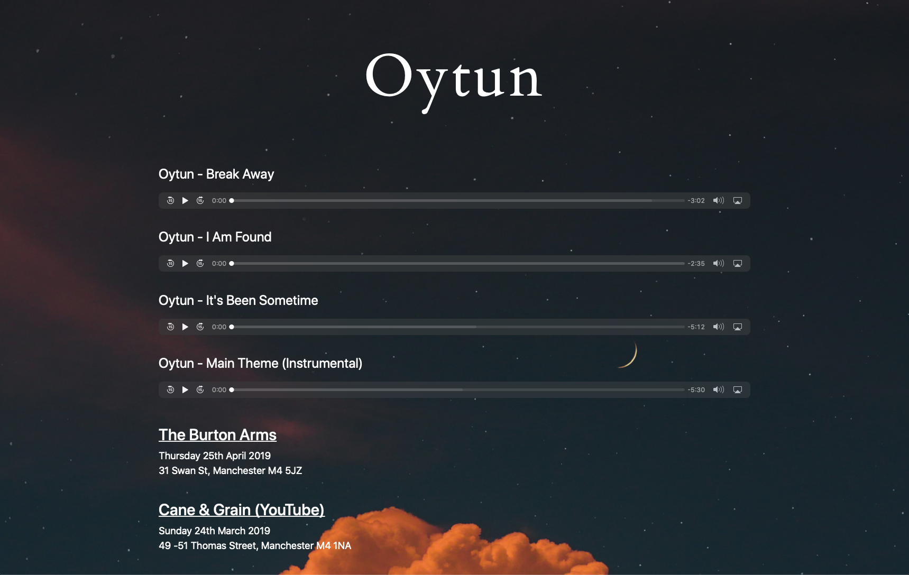

# Oytun Music

This is a site created to host the songs and display details of live events for the artist Oytun.



## Set up development environment

### Requirements

* Python: 3.7.1
* Psql

### Installation

```bash
# Create python environment
python3 -m venv venv
source venv/bin/activate
pip install -r requirements.txt

# Set up and seed database
. scripts/create_dev_db.sh
python oytun_music/manage.py migrate
. scripts/create_super_user.sh
. scripts/seed_db.sh

# Run the local server
python oytun_music/manage.py runserver
```

The site will be available at [http://127.0.0.1:8000/](http://127.0.0.1:8000/).

The admin panel of the site will be available at [http://127.0.0.1:8000/admin](http://127.0.0.1:8000/admin) and can be accessible with the following credentials:

* Username = `test`
* Password = `test`

The psql database is named `oytun_music` and will be accessible with the following credentials:

* Username = `oytun_music`
* Password = `development_password_only`

## Model Migration Flow

1. Create or update a model
2. Run `./manage.py makemigrations music`
3. Run `./manage.py migrate music`

## Useful commands

### Create developer database and user

```bash
. scripts/create_dev_db.sh
```

### Seed database

```bash
. scripts/seed_db.sh
```

#### Connect to the database

```bash
export PGPASSWORD=development_password_only
psql -h localhost -d oytun_music -U oytun_music -p 5432 
```

#### View the sql commands a migration would run (replace migration number appropriately)

```bash
python oytun_music/manage.py sqlmigrate music 0001
```

#### Show all migrations

```bash
python oytun_music/manage.py showmigrations
```

